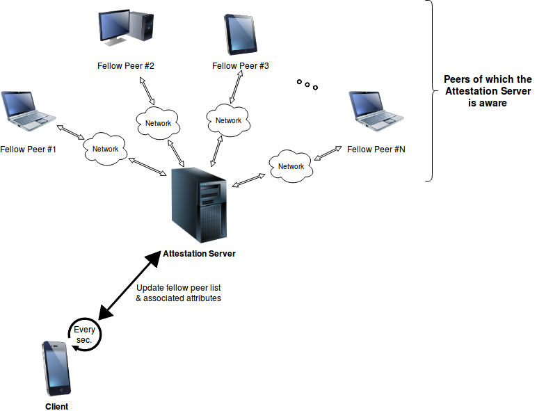
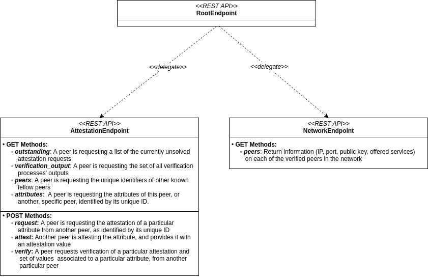

Attestation Prototype Documentation
===================================

This document describes the original design of the IPv8-based Android application and credential authority.

Passive Updates in the IPv8 Android Application:
------------------------------------------------

Example behaviour of *passive* and *regular* updates in an **IPv8 Android Application** instance, regarding fellow peer lists and their associated attributes. It should be noted that the **Attestation Server** is nothing more than a *well-known peer* itself, accessed through an HTTP URL (\ ``127.0.0.1:8086/attestation``\ ):  

**Every second**\ , the application will do the following:

#. 
   Forward a (\ **GET**\ : *peers*\ ) request to a certain peer, with the aim of updating the local list of known peers. 

#. 
   When the response for the previous request arrives, containing unique identifiers (IDs) for the fellow peers, update the local list of known peers. Simultaneously, forward a (\ **GET**\ : *attributes*\ ) for each peer ID, in order to obtain a list of the transaction names and hashes as found in the latest 200 blocks associated to the peer. The information in these responses is stored locally as well.

#. 
   Forward a (\ **GET**\ : *attributes*\ ) request to and for the peer contacted in **Step 1**. Similarly to **Step 2**\ , the response should contain the transaction names and hashes as found in the latest 200 blocks associated to the peer. This information is stored locally.

Flow of Communication in Active Attestation Requests:
-----------------------------------------------------

Example RESTful based communication flow for serving **Attestation Requests**\ , as currently implemented in the demo application:

#. 
   The **Client**\ 's user interacts with their device in order to **obtain attestation** for a particular **attribute**.

#. 
   The **Client** attempts to update the list of known peers by forwarding a (\ **GET**\ : *peers*\ ) request to a well-known fellow peer (the **Attestation Server**\ ).

#. 
   The **Client** demands **attestation** for the **attribute**\ , by forwarding a (\ **POST**\ : *request*\ ) request for the particular **attribute** to every known peer, as identified by their unique ID. In this particular demo implementation, only the well-known peer (the **Attestation Server**\ ) is forwarded the request.

#. 
   A **Fellow Peer** will await for at least one other fellow peer (the **Client**\ ) to be present in the network, before accepting and solving attestation requests. It will do so by repeatedly forwarding (\ **GET**\ : *peers*\ ) requests to the well-known peer, until this returns a non-empty list of peers.

#. 
   The **Fellow Peer** will probe for **outstanding** (i.e. as of yet unresolved) **attestation requests**. To obtain such a list, it forwards a (\ **GET**\ : *outstanding*\ ) request to the well-known peer. The request will return a list of tuples of the form ``(<b64_encoded_requesting_peer_ID>, <attribute_name>)``\ , each representing an **outstanding request**. 

#. 
   The **Fellow Peer** chooses to solve the request, and **attest** the requested **attribute**. This process is done locally, in the peer itself. The result of the attestation is encoded in *Base64* format, and packed in a (\ **POST**\ : *attest*\ ) request, which is forwarded to the well-known peer (the **Attestation Server**\ ). 

#. 
   The well-known peer (the **Attestation Server**\ ), returns the **attestation** to the **Client**\ , as a response to their original (\ **POST**\ : *request*\ ) **attestation request**.

#. 
   The **Client** receives the **attestation**\ , and displays the **successful attestation** status to the device user.

Peers and their REST APIs:
--------------------------

It should be mentioned that the protocol, which abides to the REST paradigms, used towards facilitating communication between peers, in this particular implementation, is the **Hypertext Transfer Protocol (HTTP)**.

The diagram below describes the **REST API** of an **IPv8** object (in this current implementation version). These are requests which can be handled by the **IPv8** objects:

Below, a detailed explanation of the REST Requests is presented:

* 
  **GET Methods** sent to the **AttestationEndpoint**\ :

  * 
    ``type = "outstanding"`` : Retrieve a list of tuples of the form ``(<b64_encoded_requesting_peer_ID>, <attribute_name>)``\ , each representing an, as of yet, unresolved attestation request (from a peer identified by ``<b64_encoded_requesting_peer_ID>`` for the attribute ``<attribute_name>``\ ).

  * 
    ``type = "verification_output"`` : Retrieve a dictionary (equivalently, a map) of the form: ``<b64_attribute_name_hash> -> (<b64_attribute_value_hash>, <confidence_value>)``. The dictionary should contain a record of all the previous verification processes' results.

  * 
    ``type = "peers"`` : Retrieve a list of Base64 encoded peer IDs, which uniquely identify the peers in the **first Identity Overlay**. 

  * 
    ``type = "attributes"`` : Return a list of tuples of the form ``(<transaction_name>, <b64_transaction_hash>)``\ , from the the latest 200 blocks associated with a **particular peer**.

    *Optional parameters* :

    * ``mid = <b64_peer_mid>`` : Identifies the **particular peer** (using its unique ID) whose attributes are being requested. If this parameter is missing, the **peer** shall default to the target endpoint's peer.

* 
  **POST Methods** sent to the **AttestationEndpoint**\ :

  * 
    ``type = "request"`` : Request the attestation of a particular attribute from a particular peer.

    *Required additional parameters* :

    * 
      ``mid = <b64_peer_mid>``\ : Identifies the peer (by its unique ID) from which the attestation is requested.

    * 
      ``attribute_name = <attribute_name>``\ : The name of the attribute, for which attestation is requested.

  * 
    ``type = "attest"`` : Attest a particular attribute, for a particular peer. Additionally, return an attested value for the aforementioned attribute.

    *Required additional parameters* :

    * 
      ``mid = <b64_peer_mid>``\ : Identifies the peer (by its unique ID) from which the attestation is requested. 

    * 
      ``attribute_name = <attribute_name>``\ : The name of the attribute, for which attestation is requested.

    * 
      ``attribute_value = <b64_attribute_value>``\ : Base64 encoded attested value for the attribute.

  * 
    ``type = "verify"`` : Request the verification of a particular attestation and set of values associated to a particular attribute, from another particular peer.

    *Required additional parameters* :

    * 
      ``mid = <b64_peer_mid>``\ : Identifies the peer (by its unique ID) from which the attestation is requested.

    * 
      ``attribute_hash = <b64_attribute_hash>``\ : A Base64 encoded hash of the attribute's particular attestation, subject to verification.

    * 
      `attribute_values = <b64_attribute_values_string>`: A variable length list of Base64 encoded attribute values, for which verification is required. `<b64_attribute_values_string>` is a comma separated string of values, that is: ``<b64_attribute_values_string> = "<b64_attr_val_1>,<b64_attr_val_2>,...,<b64_attr_val_N>"``\ , where ``N`` may be arbitrarily large.    

* 
  **GET Methods** sent to the **NetworkEndpoint**\ :

  * **Any GET request**\ : Retrieve a dictionary (equivalently, a map) holding information on each verified peer in the network. The dictionary's structure will be the following: ``<b64_peer_mid> -> {"id": <peer_IP>, "port": <peer_port>, "public_key": <b64_peer_public_key>, "services": <b64_peer_services_list>}``. ``<b64_peer_services_list>`` is a list which identifies the known services supported by the peer. The dictionary itself is returned within a dictionary: ``{"peers": <peers_info_dictionary>}``.

The diagram below describes the **REST Requests** implemented in the **Android Application** (in this current implementation version). These requests are forwarded to, and handled by the **IPv8** object's **REST APIs**\ :

.. image:: ./resources/android_rest_api.png
   :target: ./resources/android_rest_api.png
   :alt: Alt Text

All requests must abide to the specifications detailed above (in this section). 

Attestation Process: Detailed Explanation
-----------------------------------------

Below is a detailed description of the general flow for handling **incoming attestation requests**. It should be noted that this description is general, and does not necessarily refer to this particular implementation version (i.e. of the demo). Moreover, the reader shoould also note that **attestation** is requested from a particular peer (see documentation above for (\ **POST**\ ): *attest* @ **AttestationEndpoint**\ ), however, the actual HTTP request is forwarded to another peer, potentially different from the **attester** itself. Hence, there shall be two cases for the **attestation request**\ :

#. 
   When a peer receives the HTTP request, packs it, and forwards it to the peer from which attestation is requested (i.e. the **attester** peer).

#. 
   When the peer from which attestation is requested (i.e. the **attester** peer) receives the attestation request itself, as obtained from the 1st case.

The two cases shall be further described in the sections to follow. To better understand what each of them do, however, we must introduce two callback methods of the ``AttestationCommunity`` class, located in the **community.py** module. The two callbacks are stored in the ``self.attestation_request_callbacks`` field, which is an array that should contain 2 elements, intuitively, each being a callback. The methods which set the callbacks are described in the following (both are located in the ``AttestationCommunity`` class):

* 
  `set_attestation_request_callback(f)`: this is the method which stores the function `f` in `self.attestation_request_callbacks[0]` field. `f` is the method actually handles the **attestation**. This method is called in `AttestationCommunity`'s `on_request_attestation` method when some peer requests the attestation from us (i.e. we are the **attester**). `f` must return a string if the attestation is made, this represents the attestation value. If `None` is returned, however, the attestation is not made. As input, `f` receives the following:

  * 
    ``<sender_peer>: Peer``\ : A ``Peer`` object representing the peer which forwarded this request to us.

  * 
    ``<attribute_name>: string``\ : A ``string`` object, representing the name of the attribute requiring attestation.

* 
  `set_attestation_request_complete_callback(f)`: this is the method which stores the function `f` in `self.attestation_request_callbacks[1]` field. `f` is called back when an attestation has been completed.`f` needn't return anything. It should accept the following input parameters:

  * 
    ``<sender_peer>: Peer``\ : A ``Peer`` object representing the peer which forwarded this request to us.

  * 
    ``<attribute_name>: string``\ : A ``string`` object, representing the name of the attribute requiring attestation.

  * 
    ``<attestation_hash>: string``\ :  A ``string`` object, representing the hash of the attestation blob.

  * 
    ``<signer_peer> = None: string``\ : A ``Peer`` object representing the signer of the attestation (i.e. usually us).

Below is a description of the two scenarios of the attestation process presented above. **Make sure to also read this section's last subsection. It contains details on how the attestation process works for this demo implementation**.

Receiving the HTTP Attestation Request
^^^^^^^^^^^^^^^^^^^^^^^^^^^^^^^^^^^^^^

In the **community.py** module, and the ``AttestationCommunity`` class, the method ``request_attestation`` is called by the ``render_POST`` method in the ``AttestationEndpoint`` class, upon receiving a (\ **POST**\ : *request*\ ) HTTP request. Attestation might be required from the peer receiving this request, or from another peer. Regardless, the ``request_attestation`` method will do the following:

#. 
   It will add the request to its own *request cache*.

#. 
   It will create some **metadata** from the request, that is: the *attribute's name* to be attested, and the request's *public key*.

#. 
   It will create 3 payloads: an **authentication payload** (communication security between this peer and the **attester**\ ), the actual **attestation request payload** (created from the metadata), and the **time distribution payload** (created from the global time). The payloads are packed together in a packet which is forwarded to the attester.

It should be noted that this method should normally be called once, when a raw (\ **POST**\ : *request*\ ) HTTP request is received. This method will send a packet (with the contents as described above) directly to the **attester** peer, which might, in fact, be this peer, or another different peer.

Receiving the Attestation Request in the Attester Peer
^^^^^^^^^^^^^^^^^^^^^^^^^^^^^^^^^^^^^^^^^^^^^^^^^^^^^^

In the **community.py** module and the ``AttestationCommunity`` class, the method ``on_request_attestation`` is called when attestation is requested from us. That is, when an attestation packet, as created by the ``request_attestation`` method in the ``AttestationCommunity`` is received. The ``on_request_attestation`` method will do the following:

#. 
   Unpack the packet, and get the 3 payloads: **attestation payload**\ , **request payload**\ , and **time distribution payload**. The source of the request is seen as the peer which last forwarded the request. 

#. 
   The attestation payload's metadata is retrieved and is used towards the attestation process. Attestation is performed by calling the ``self.attestation_request_callbacks[0]`` with the *source peer* and *attribute name* as parameters. If a value is returned, attestation has been performed, otherwise attestation has not been performed.  

#. 
   A blob is created from the attestation value. The blob is first used as a parameter in the ``self.attestation_request_callbacks[1]``\ , together with the *source peer*\ , and the *attribute name*. After returning from the aforementioned call, the attestation blob is sent to the *source peer* (i.e. the peer from which we received this request). 

Side Note: Detailed Attestation Flow in the Demo
^^^^^^^^^^^^^^^^^^^^^^^^^^^^^^^^^^^^^^^^^^^^^^^^

This case is a bit curious, since the peer forwarding the (\ **POST**\ : *attest*\ ) HTTP request (i.e. the peer running in the **main.py** script, in the method ``make_attribute``\ ), is indeed solving the **attestation request**\ , however, it is not actually holding it. In the demo, the peer holding the request is the well-known peer behind ``localhost:8086/attestation`` URL. The agent running in the **main.py** script is made aware of the request by having previously forwarded a (\ **GET**\ : *outstanding*\ ) HTTP request to the well-known peer. It will serve the attestation request by forwarding a (\ **POST**\ : *attest*\ ) request back to the ``localhost:8086/attestation`` (well-known) peer. 

As previously mentioned, the well-known peer behind ``localhost:8086/attestation`` is actually holding the **attestation requests**. For each request forwarded to this peer, a ``Deferred`` object is created, which is attached to a ``yield``. This is done in the ``on_request_attestation`` method (of the ``AttestationEndpoint`` class), which is called as ``self.attestation_request_callbacks[0]`` in ``on_request_attestation`` method (of the ``AttestationCommunity`` class). The ``yield`` will suspend the thread, which will now wait for the ``Deferred`` object to yield something. For this object to yield something, someone has to call the ``Deferred.callback(<value>)`` method on it. This is done when the agent behind **main.py** forwards a (\ **POST**\ : *attest*\ ) HTTP request to the well-known peer. In the ``render_POST`` method of ``AttestationEndpoint`` class, for this ``type`` of request, the deferred object is retrieved, and called back with an attestation value (obtained from the (\ **POST**\ : *attest*\ ) request) as the ``<value>`` parameter. This allows the ``Deferred`` object to yield this value, and, in turn, allows the ``on_request_attestation`` (of ``AttestationCommunity``\ ) method to continue executing, which was halted by its call to ``self.attestation_request_callbacks[0]``\ , i.e. ``on_request_attestation`` (of ``AttestationEndpoint``\ ). The ``on_request_attestation`` (of ``AttestationCommunity``\ ) eventually calls ``self.attestation_request_callbacks[1]``\ , i.e. ``on_attestation_complete``\ , and finally sends back the attestation to the source peer.

Annex: General Notes on Demo Classes
------------------------------------

Notes on the IPv8 application
^^^^^^^^^^^^^^^^^^^^^^^^^^^^^

Below is a brief description of some of the important classes in the IPv8 application (which are employed in the demo):

* 
  The ``RootEndpoint`` class will be the one which receives the requests from the peers. This class will delegate work to its children. Currently, the children are: ``AttestationEndpoint`` and ``NetworkEndpoint``. All these classes must subclass the BaseEndpoint class. The request chain is modeled like a tree, where the ``RootEndpoint`` is the root of the tree and the ``AttestationEndpoint`` and ``NetworkEndpoint`` classes are its children (and implicitly leaves) . When they are added, they are associated a ``path``\ , which is the ``endpoint`` field of the request (e.g. *attestation* or *network*\ ). This is how the root knows to delegate requests to the right children (e.g. ``<node_ip>:<port>/<path>``\ ).

* 
  The ``NetworkEndpoint`` handles the *peer discovery* requests. It is (currently) a simple class which has the simple task of returning a list of verified nodes in the system and some relevant information on them, such as: *IP*\ , *port*\ , *public key*\ , and *offered services*. However, the Android Phone Application does not forward requests (GET or POST) to this endpoint. 

* 
  The ``AttestationEndpoint`` class handles a set of both **POST** and **GET** requests. It features a more complex set of methods than ``NetworkEndpoint``.

* 
  The ``Response`` class is used to model HTTP responses. It will essentially just define a response (status_code, content) which will then be sent back as a response.

* 
  The ``RESTManager`` class handles the start and stop of the server's HTTP API service. On startup, the class will create a ``RootEndpoint`` object, which will implicitly create the two objects: a ``NetworkEndpoint`` object and an ``AttestationEndpoint`` object. It will then attach itself to incoming request from ``localhost`` (\ ``127.0.0.1``\ ) at port ``8085``. To create a ``RestManager`` object, one must submit a *session* object, which is in fact of the ``IPv8`` class type (this latter instantiation requires a *configuration* object).

Notes on the Python Scripts
^^^^^^^^^^^^^^^^^^^^^^^^^^^

The **roles.py** script
~~~~~~~~~~~~~~~~~~~~~~~~~~~

* 
  Holds the class ``TestRESTAPI`` which is a subclass of ``RESTManager``. It does the exact same thing as the ``RESTManager`` class, with the singular difference that it listens for incoming request on the ``8086`` port.

* 
  The function ``sleep(time)`` is a simple NOOP function, which essentially forces the thread to sleep for a user specified amount of time (set by the parameter ``time``\ ), since it forces it to wait for a deferred to yield.

* 
  The ``create_working_dir(path)`` function creates a working directory at the specified path, which will hold a number of **.pem** files, and an **sqlite** database (currently, for attestation and identity matters).

* 
  The ``initialize_peer(path)`` function is used to create a peer (of type ``TestRESTAPI``\ ). It will generate a default peer configuration, which it will then modify to set the network overlays, which in this case is a *AttestationCommunity* and an *IdentityCommunity*. It will also set a peer discovery strategy within each of those overlays, which in this case is a *RandomWalk* with a limit of 20 peers and timeout of 60 seconds. A working directory is constructed, as described above (\ ``create_working_dir(*)``\ ). From this *configuration* an ``IPv8`` object is created, which is in turn used to create the peer, i.e. the ``TestRESTAPI``. This will also be assigned a (blank) HTML interface at ``URL = 127.0.0.1:8086/attestation``\ , that will define an access point to its REST API. The URL will be returned as the second object of the return statement.

* 
  The ``stop_peers(*peers)`` function will simply do its best to stop the list of peers passed as parameter to it.

* 
  The ``make_request(url, type, arguments={})`` function forwards a request of the specified ``type`` to the specified ``url``\ , with the specified set of ``arguments``. In this particular example, we usually have\ ``url = '127.0.0.1:8086/attestation'``\ , (\ **GET**\ ) (for **peers** and **outstanding** attestation requests) and (\ **POST**\ ) (for attesting outstanding requests). This function uses an ``Agent`` object, which models a simple HTTP client, that is able to generate HTTP requests given a set of parameters. Requests forwarded by this method are attached a callback, which is able to read the HTTP response body. 

The **main.py** script
~~~~~~~~~~~~~~~~~~~~~~~~~~

* 
  This script does not define any classes. It only defines a set of functions.

* 
  This script creates a peer object by calling **roles.py**\ 's ``initialize_peer(path)``\ , with the ``path = "attester"``\ , and retrieves its URL towards accessing its REST API (\ ``idowner_restapi = 127.0.0.1:8086/attestation``\ ).

* 
  The ``wait_for_peers(idowner_restapi)`` function will forward a (\ **GET**\ : *peers*\ ) request towards the ``idowner_restapi`` URL, i.e. the peer located behind it. The methods seeks to discover other peers in the network. It recursively calls itself every 4 seconds. Upon identification of at least one peer, it will stop calling itself, and return the list of discovered peers.

* 
  The ``wait_for_attestation_request(attester_restapi)`` function will forward a (\ **GET**\ : *outstanding*\ ) towards the ``idowner_restapi`` URL, i.e. the peer located behind it. This methods seeks to find any, as of yet, unresolved *attestation* requests. It will recursively call itself every 4 seconds. Upon identification of at least one outstanding request, it will stop calling itself, and return the list of discovered requests.

* 
  The ``make_attribute()`` method implements the main logic of the **main.py** script. It is triggered by a 500 millisecond  deferred call . The method's flow is the following: It fist awaits for at least one fellow peer to show up by calling ``wait_for_peers(idowner_restapi)``\ , where the ``idowner_restapi`` is the URL of the ``TestRESTAPI`` object created as a global variable within the script. After this, it will await for at least one request to appear, by calling ``wait_for_attestation_request(attester_restapi)``\ , where the ``idowner_restapi`` is the URL of a ``TestRESTAPI`` object created as a global variable within the script. It will then solve each request by forwarding a (\ **POST**\ : *attest*\ ) with the requested attribute ("\ **QR**\ ") and a random encoded value associated to this attribute (since it is a demo) back to the ``TestRESTAPI`` object via its public URL. Once it finishes solving the requests it had initially found, it will end its loop and terminate its activity. 

Notes on the Android Application
^^^^^^^^^^^^^^^^^^^^^^^^^^^^^^^^

The **MainActivity** class
~~~~~~~~~~~~~~~~~~~~~~~~~~~~~~

The following outlines the main behaviour of this class

* 
  Every second, the following happens: 

  * 
    The application will probe for peers. It does so by forwarding a (\ **GET**\ : *peers*\ ) to a well-known peer. If successful, the request will yield a response with an updated list of peers (represented by their unique IDs). Response timing is arbitrary, and cannot be anticipated clearly since it depends on network and other factors. Regardless, the peer will attempt to employ a local data structure, which is used for storing unique peer IDs (this might have been updated in the meantime, but it is not certain). If not possible to access the aforementioned list, it will return an empty list. It should be noted that when peer IDs are retrieved, the application will try to retrieve and store their attributes as well (by forwarding (\ **GET**\ : *attributes*\ ), with an additional request parameter ``mid = <peer_mid>``\ ).

  * 
    Next, it will attempt to request (and if the response arrives on time, update) the well-known peer's attributes (by forwarding a (\ **GET**\ : *attributes*\ ), **WITHOUT** the additional request parameter ``mid = <peer_mid>``\ ). Generally, however, this step refers to retrieving the local attributes list of the known peers (which should have been obtained as a collateral of the peer discovery process, as described above). If the list is not in use, it will return it, otherwise, an empty list is returned. If the list is empty, then the button, which demands attestation, is  turned red, otherwise it is turned green.  

* 
  Asynchronously, the user may press the button on the interface, which will require that the 'QR' attribute be attested. If the application has discovered peers (i.e. at least one), then it will forward an attestation request (for this attribute) at every known peer in the network (by forwarding (\ **POST**\ : *request*\ ) HTTP requests, with additional request parameters ``mid = <peer_mid>``\ , and ``attribute_name = "QR"``\ ). Although attestation is requested from specific peers, in this demo implementation, any peer can solve them (see section **Side Note: Detailed Attestation Flow in the Demo**\ ). All requests are forwarded to the well-known peer.

The **SingleShotRequest** class
~~~~~~~~~~~~~~~~~~~~~~~~~~~~~~~~~~~

This class models a simple HTTP request, whose destination is hard-coded to be ``localhost:8085``. The constructor allows one to specify the endpoint (currently, we can have *attestation* or *network*\ , the latter not being used in the current Application implementation). It is also possible to specify the method (e.g. *POST*\ , *GET*\ , *PUT*\ , etc.), and a collection of (key, value) tuples, which act as the request's parameters. It should be noted that one specifies the nature of the request as part of the latter parameter, using the ``('type', <req_type>)`` tuple (\ ``<req_type>`` can be *outstanding*\ , *verification_output*\ , *peers*\ , *attributes*\ , etc.).

The **AttestationRESTInterface** class
^^^^^^^^^^^^^^^^^^^^^^^^^^^^^^^^^^^^^^^^^^

This class defines a set of public methods, which handle the creation and transmission of the different types of currently available HTTP requests. The following request types are defined (all of which are forwarded to the **attestation** endpoint):

* 
  **GET Method:**

  * 
    ``retrieve_peers``\ : Forward a request for the peers in the system. Upon receiving a response, a callback is invoked to store the mid's of the discovered peers. This method also forwards requests for retrieving the peers' attributes, and relies of the callback to handle their storing. 

  * 
    ``retrieve_outstanding``\ : Forward a request for the outstanding attestation requests in the system. Upon receiving a response, a callback is invoked to locally store the collection of discovered pending attestation requests.

  * 
    ``retrieve_verification_output``\ : Forward a request to get (all) the results of the verification processes. Upon receiving a response to the request, a callback is invoked which stores the verification results locally.

  * 
    ``retrieve_attributes(String mid)``\ : Forward a request for the attributes of a particular peer in the system, as identified by their mid. On response, invoke a callback, and store the attributes of the peer locally.

  * 
    ``retrieve_attributes(void)``\ :  Forward a request for the attributes of the peer this request is sent to. On response, invoke a callback, which stores the attributes of the peer locally.

* 
  **POST Method:**

  * 
    ``put_request``\ : Forward a request which asks for attestation of a particular attribute from a particular peer.

  * 
    ``put_attest``\ : Attests a particular value of a particular attribute for a particular peer.

  * 
    ``put_verify``\ : Forward a request which asks for verification from a particular peer of a particular set of values associated to a particular attribute.
